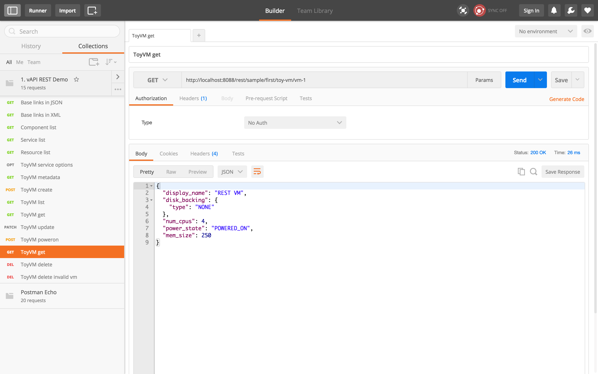

 

# Overview
The ToyVM Java server allows invocation of the APIs via HTTP REST API requests. Each operation in the VMODL2 API definition will be mapped to a HTTP request on a specific URL.<br/>
**Note:** C++ and Python servers **DO NOT** expose REST

# IDL to REST Mapping

The API defined in VMODL2 is mapped to REST URLs automatically by the vAPI framework.
For [ToyVM VMODL2](../modeling_the_api/README.md), the following table describes the mapping from an operation in VMODL2 to a REST URL.

| **VMODL2 Operation**                   | **HTTP Verb** | **REST URL**                                             |
|----------------------------------------|---------------|----------------------------------------------------------|
| ID create(CreateSpec spec);            | POST          | /rest/sample/first/toy-vm                                |
| Info get(ID vmId);                     | GET           | /rest/sample/first/toy-vm/&lt;id&gt;                  |
| void update(ID vmId, UpdateSpec spec); | PATCH         | /rest/sample/first/toy-vm/&lt;id&gt;                  |
| void delete(ID vmId)                   | DELETE        | /rest/sample/first/toy-vm/&lt;id&gt;                  |
| Set&lt;ID&gt; list();                  | GET           | /rest/sample/first/toy-vm                                |
| void powerOn(ID vmId);                 | POST          | /rest/sample/first/toy-vm/&lt;id&gt;?~action=power-on |

# Using CURL
**Set up the environment** by disabling the proxies and adding bash helper libraries. pjson and pxml will help us pretty print the output from the server.

<div class="codePart">
    $ export http_proxy=  
    $ pjson() { python -c "import json; import sys; print  json.dumps(json.loads(sys.stdin.read()), sort_keys=True, indent=2)"; };  
    $ pxml () { python -c "import sys; import xml.dom.minidom; print xml.dom.minidom.parseString(sys.stdin.read()).toprettyxml(indent='  ')"; };  
</div>
To retrieve the information about **HTTP operations** that can be invoked on a particular URL, use HTTP OPTIONS request.

<div class="codePart">
    $ curl -s 1 -H 'Accept:application/json' -X OPTIONS '<http://localhost:8088/rest/sample/first/toy-vm>' | pjson
    <span class="collapseTitle collapsed" data-toggle="collapse" data-target="#listOptions">&nbsp;</span>
    <div id="listOptions" class="collapseContent collapse">
```json
{
  "value": [
    {
      "documentation": "Returns the properties of a virtual machine.", 
      "links": [
        {
          "href": "http://localhost:8088/rest/sample/first/toy-vm/{vm_id}", 
          "method": "GET"
        }, 
        {
          "href": "http://localhost:8088/rest/sample/first/toy-vm/{vm_id}?~action=get", 
          "method": "POST"
        }, 
        {
          "href": "http://localhost:8088/rest/sample/first/toy-vm?~action=get", 
          "method": "POST"
        }
      ], 
      "metadata": {
        "href": "http://localhost:8088/rest/com/vmware/vapi/metadata/metamodel/service/operation/sample.first.toy_VM/get", 
        "method": "GET"
      }, 
      "name": "get", 
      "service": "sample.first.toy_VM"
    }, 
    {
      "documentation": "Resets a powered-on virtual machine.", 
      "links": [
        {
          "href": "http://localhost:8088/rest/sample/first/toy-vm?~action=reset", 
          "method": "POST"
        }, 
        {
          "href": "http://localhost:8088/rest/sample/first/toy-vm/{vm_id}?~action=reset", 
          "method": "POST"
        }
      ], 
      "metadata": {
        "href": "http://localhost:8088/rest/com/vmware/vapi/metadata/metamodel/service/operation/sample.first.toy_VM/reset", 
        "method": "GET"
      }, 
      "name": "reset", 
      "service": "sample.first.toy_VM"
    }, 
    {
      "documentation": "Updates the properties of a virtual machine.", 
      "links": [
        {
          "href": "http://localhost:8088/rest/sample/first/toy-vm/{vm_id}", 
          "method": "PATCH"
        }, 
        {
          "href": "http://localhost:8088/rest/sample/first/toy-vm?~action=update", 
          "method": "POST"
        }, 
        {
          "href": "http://localhost:8088/rest/sample/first/toy-vm/{vm_id}?~action=update", 
          "method": "POST"
        }
      ], 
      "metadata": {
        "href": "http://localhost:8088/rest/com/vmware/vapi/metadata/metamodel/service/operation/sample.first.toy_VM/update", 
        "method": "GET"
      }, 
      "name": "update", 
      "service": "sample.first.toy_VM"
    }, 
    {
      "documentation": "Enumerates the set of registered virtual machines.", 
      "links": [
        {
          "href": "http://localhost:8088/rest/sample/first/toy-vm?~action=list", 
          "method": "POST"
        }, 
        {
          "href": "http://localhost:8088/rest/sample/first/toy-vm", 
          "method": "GET"
        }
      ], 
      "metadata": {
        "href": "http://localhost:8088/rest/com/vmware/vapi/metadata/metamodel/service/operation/sample.first.toy_VM/list", 
        "method": "GET"
      }, 
      "name": "list", 
      "service": "sample.first.toy_VM"
    }, 
    {
      "documentation": "Suspends a powered-on virtual machine.", 
      "links": [
        {
          "href": "http://localhost:8088/rest/sample/first/toy-vm?~action=suspend", 
          "method": "POST"
        }, 
        {
          "href": "http://localhost:8088/rest/sample/first/toy-vm/{vm_id}?~action=suspend", 
          "method": "POST"
        }
      ], 
      "metadata": {
        "href": "http://localhost:8088/rest/com/vmware/vapi/metadata/metamodel/service/operation/sample.first.toy_VM/suspend", 
        "method": "GET"
      }, 
      "name": "suspend", 
      "service": "sample.first.toy_VM"
    }, 
    {
      "documentation": "Creates a new virtual machine.", 
      "links": [
        {
          "href": "http://localhost:8088/rest/sample/first/toy-vm?~action=create", 
          "method": "POST"
        }, 
        {
          "href": "http://localhost:8088/rest/sample/first/toy-vm", 
          "method": "POST"
        }
      ], 
      "metadata": {
        "href": "http://localhost:8088/rest/com/vmware/vapi/metadata/metamodel/service/operation/sample.first.toy_VM/create", 
        "method": "GET"
      }, 
      "name": "create", 
      "service": "sample.first.toy_VM"
    }, 
    {
      "documentation": "Deletes a virtual machine.", 
      "links": [
        {
          "href": "http://localhost:8088/rest/sample/first/toy-vm/{vm_id}", 
          "method": "DELETE"
        }, 
        {
          "href": "http://localhost:8088/rest/sample/first/toy-vm/{vm_id}?~action=delete", 
          "method": "POST"
        }, 
        {
          "href": "http://localhost:8088/rest/sample/first/toy-vm?~action=delete", 
          "method": "POST"
        }
      ], 
      "metadata": {
        "href": "http://localhost:8088/rest/com/vmware/vapi/metadata/metamodel/service/operation/sample.first.toy_VM/delete", 
        "method": "GET"
      }, 
      "name": "delete", 
      "service": "sample.first.toy_VM"
    }, 
    {
      "documentation": "Powers off a powered-on or suspended virtual machine.", 
      "links": [
        {
          "href": "http://localhost:8088/rest/sample/first/toy-vm?~action=power-off", 
          "method": "POST"
        }, 
        {
          "href": "http://localhost:8088/rest/sample/first/toy-vm/{vm_id}?~action=power-off", 
          "method": "POST"
        }
      ], 
      "metadata": {
        "href": "http://localhost:8088/rest/com/vmware/vapi/metadata/metamodel/service/operation/sample.first.toy_VM/power_off", 
        "method": "GET"
      }, 
      "name": "power_off", 
      "service": "sample.first.toy_VM"
    }, 
    {
      "documentation": "Powers on a powered-off or suspended virtual machine.", 
      "links": [
        {
          "href": "http://localhost:8088/rest/sample/first/toy-vm/{vm_id}?~action=power-on", 
          "method": "POST"
        }, 
        {
          "href": "http://localhost:8088/rest/sample/first/toy-vm?~action=power-on", 
          "method": "POST"
        }
      ], 
      "metadata": {
        "href": "http://localhost:8088/rest/com/vmware/vapi/metadata/metamodel/service/operation/sample.first.toy_VM/power_on", 
        "method": "GET"
      }, 
      "name": "power_on", 
      "service": "sample.first.toy_VM"
    }
  ]
}
```
</div>
</div>
**To create** a new virtual machine, use HTTP POST on the base service URL `/sample/first/toy-vm`. This URL maps to the `create()` operation in ToyVM VMODL2 file.

<div class="codePart">
    $ curl -s 1 -H 'Accept:application/json' -H 'Content-Type:application/json' -X POST --data-ascii '{ "spec": { "display_name": "REST VM" } }' 'http://localhost:8088/rest/sample/first/toy-vm' | pjson
```json
{
  "value": "vm-1"
}
```
</div>
**To list** the available virtual machines, invoke a HTTP GET on the base service URL `/sample/first/toy-vm`.

<div class="codePart">
    $ curl -s 1 -H 'Accept:application/json' 'http://localhost:8088/rest/sample/first/toy-vm' | pjson
```json
{
    "value": [
        "vm-1"
    ]
}
```
</div>
**To get** information about a particular virtual machine, append the identifier to the base service URL and invoke HTTP GET.

<div class="codePart">
    $ curl -s 1 -H 'Accept:application/json' 'http://localhost:8088/rest/sample/first/toy-vm/vm-1' | pjson
```json
{
  "disk_backing": {
    "type": "NONE"
  },
  "display_name": "REST VM",
  "mem_size": 32,
  "num_cpus": 1,
  "power_state": "POWERED_OFF"
}
```
</div>
**To update** a virtual machine, use HTTP PATCH method. This URL maps to `update()` operation in ToyVM VMODL2.

<div class="codePart">
    $ curl -s 1 -H 'Accept:application/json' -H 'Content-Type:application/json' -X PATCH --data-ascii '{ "spec": { "num_cpus": 2 } }' 'http://localhost:8088/rest/sample/first/toy-vm/vm-1'
</div>
To invoke a **non-CRUD action** on the virtual machine. For example, power-on. All the non-CRUD based operations in ToyVM VMODL2 are exposed using `~action`.

<div class="codePart">
    $ curl -s 1 -H 'Accept:application/json' -X POST 'http://localhost:8088/rest/sample/first/toy-vm/vm-1?~action=power-on'
</div>
The change of power state and change in number of CPUs can be noticed by gettings details of that particular virtual machine.

<div class="codePart">
    $ curl -s 1 -H 'Accept:application/json' 'http://localhost:8088/rest/sample/first/toy-vm/vm-1' | pjson
```json
{
  "disk_backing": {
    "type": "NONE"
  },
  "display_name": "REST VM",
  "mem_size": 32,
  "num_cpus": 2,
  "power_state": "POWERED_ON"
}
```
</div>
**To delete** a virtual machine, use HTTP DELETE operation. This maps to `delete()` operation in ToyVM VMODL2.

<div class="codePart">
    $ curl -s 1 -H 'Accept:application/json' -X DELETE 'http://localhost:8088/rest/sample/first/toy-vm/vm-1'
</div>
If we try to get the details of a non existant resource, an error is thrown:

<div class="codePart">
    $ curl -s 1 -H 'Accept:application/json' 'http://localhost:8088/rest/sample/first/toy-vm/vm-1' | pjson
```json
{
  "type": "com.vmware.vapi.std.errors.not_found", 
  "value": {
    "messages": [
      {
        "args": [
          "vm-1"
        ], 
        "default_message": "Virtual machine vm-1 not found", 
        "id": "sample.first.toyvm.not_found"
      }
    ]
  }
}
```
</div>
&nbsp;

# Using Postman

-   Download [Postman for chrome](https://chrome.google.com/webstore/detail/postman-rest-client/fdmmgilgnpjigdojojpjoooidkmcomcm?hl=en) to invoke REST API requests from the browser and create workflows.
-   Import the workflow available in `$VAPI_PDK/toyvm/tools/postman.json` using the import mechanism in postman client. The workflow has all the REST API requests used in the CURL examples above.
-   Once the import is successful, you should be able to see all the REST URLs on the left hand side.



# Navigation

vAPI REST also has navigation features that lets a user discover the list of REST endpoints exposed by the vAPI server. Invoking the base URL

<div class="codePart">
    $ curl -s 1 -H 'Accept:application/json' 'http://localhost:8088/rest' | pjson
```json
{
  "components": {
    "href": "http://localhost:8088/rest/com/vmware/vapi/rest/navigation/component",
    "metadata": {
      "href": "http://localhost:8088/rest/com/vmware/vapi/metadata/metamodel/service/operation/com.vmware.vapi.rest.navigation.component/list",
      "method": "GET"
    },
    "method": "GET"
  },
  "resources": {
    "href": "http://localhost:8088/rest/com/vmware/vapi/rest/navigation/resource",
    "metadata": {
      "href": "http://localhost:8088/rest/com/vmware/vapi/metadata/metamodel/service/operation/com.vmware.vapi.rest.navigation.resource/list",
      "method": "GET"
    },
    "method": "GET"
  }
}
```
</div>
Invoking the base URL with XML as the content type.

<div class="codePart">
    $ curl -s 1 -H 'Accept:application/xml' 'http://localhost:8088/rest' | pxml
```xml
<?xml version="1.0" ?>
<ns0:Info xmlns:ns0="http://vmware.com/vapi/rest/navigation/root" xmlns:xsi="http://www.w3.org/2001/XMLSchema-instance">
  <resources>
    <method>GET</method>
    <href>http://localhost:8088/rest/com/vmware/vapi/rest/navigation/resource</href>
    <metadata>
      <method>GET</method> 
      <href>http://localhost:8088/rest/com/vmware/vapi/metadata/metamodel/service/operation/com.vmware.vapi.rest.navigation.resource/list</href> 
    </metadata>
  </resources>
  <components>
    <method>GET</method>
    <href>http://localhost:8088/rest/com/vmware/vapi/rest/navigation/component</href> 
    <metadata> 
      <method>GET</method> 
      <href>http://localhost:8088/rest/com/vmware/vapi/metadata/metamodel/service/operation/com.vmware.vapi.rest.navigation.component/list</href> 
    </metadata>
  </components>
</ns0:Info>
```
</div>
To retrieve the list of available components exposed by the server.

<div class="codePart">
    $ curl -s 1 -H 'Accept:application/json' 'http://localhost:8088/rest/com/vmware/vapi/rest/navigation/component' | pjson
```json
{
  "value": [
    {
      "documentation": "",
      "name": "vapi_common",
      "services": {
        "href": "http://localhost:8088/rest/com/vmware/vapi/rest/navigation/service?component_id=vapi_common",
        "metadata": {
          "href": "http://localhost:8088/rest/com/vmware/vapi/metadata/metamodel/service/operation/com.vmware.vapi.rest.navigation.service/list",
          "method": "GET"
        },
        "method": "GET"
      }
    },
    {
      "documentation": "",
      "name": "com.vmware.vapi.rest.navigation",
      "services": {
        "href": "http://localhost:8088/rest/com/vmware/vapi/rest/navigation/service?component_id=com.vmware.vapi.rest.navigation",
        "metadata": {
          "href": "http://localhost:8088/rest/com/vmware/vapi/metadata/metamodel/service/operation/com.vmware.vapi.rest.navigation.service/list",
          "method": "GET"
        },
        "method": "GET"
      }
    },
    {
      "documentation": "",
      "name": "sample.first",
      "services": {
        "href": "http://localhost:8088/rest/com/vmware/vapi/rest/navigation/service?component_id=sample.first",
        "metadata": {
          "href": "http://localhost:8088/rest/com/vmware/vapi/metadata/metamodel/service/operation/com.vmware.vapi.rest.navigation.service/list",
          "method": "GET"
        },
        "method": "GET"
      }
    }
  ]
}
```
</div>
To get the list of services exposed by a particular component.

<div class="codePart">
    $ curl -s 1 -H 'Accept:application/json' 'http://localhost:8088/rest/com/vmware/vapi/rest/navigation/service?component_id=sample.first' | pjson
```json
{
  "value": [
    {
      "documentation": "The {@name ToyVM} {@term service} provides {@term operations} to manage a very simplified virtual machine.",
      "href": "http://localhost:8088/rest/sample/first/toy-vm",
      "metadata": {
        "href": "http://localhost:8088/rest/com/vmware/vapi/metadata/metamodel/service/operation/com.vmware.vapi.rest.navigation.options/get",
        "method": "GET"
      },
      "method": "OPTIONS",
      "name": "sample.first.toy_VM"
    }
  ]
}
```
</div>
&nbsp;

# Next Steps
- To learn more about the mapping from VMODL2 operations to REST APIs: [VMODL2 to REST mapping specification](https://wiki.eng.vmware.com/VAPI/Specs/REST/MethodMapping).
