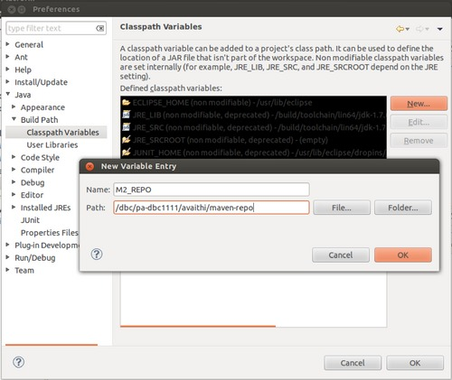
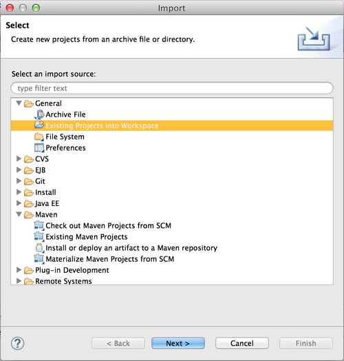
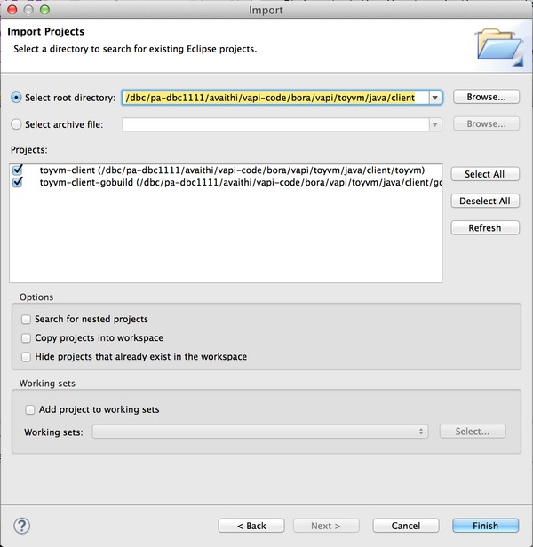
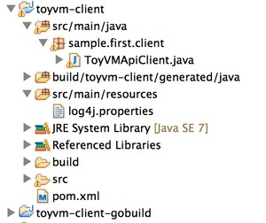

 

# Overview
Once the new provider service is up and running, you can use Java to connect to the server and invoke its APIs. This tutorial provides instructions to stand up a client service by running individual commands, using shell script, using maven or via Eclipse. The underlying steps in all the methods are the same as the sub-steps while executing individual commands.

# Using Maven
In maven the details of each step of the process to stand up a service is defined in the `pom.xml` files.

-   There is a parent `pom.xml` in the start of client folder at `$VAPI_PDK/toyvm/java/client`.
-   Then there is a `pom.xml` in each of the `local-deps` and `toyvm` sub-modules which.
-   The `local-deps` module contains nothing but the `pom.xml` which has plugins to install the vAPI dependencies available in the PDK into the local maven repository.
-   The `toyvm` module contains the source and resource files. The `pom.xml` in this module is responsible for generation of the metadata and java bindings, adding resources and other details needed by the maven and java compiler.

***Note***: Before running the maven command, configure your environment using the instructions [here](../setting_up/configuring_the_environment.md#java)

The Java client project can be built using maven:

<div>
    <!-- Nav tabs -->
    <ul class="nav nav-tabs">
        <li class="active">
            <a id="linExecMvnTab" href="#linExecMvn" data-toggle="tab">Linux</a>
        </li>
        <li>
            <a id="winExecMvnTab" href="#winExecMvn" data-toggle="tab">Windows</a>
        </li>
    </ul>
    <div class="codePart">
        <!-- Tab panes -->
        <div class="tab-content">
            <div class="tab-pane active" id="linExecMvn">
                vapi-pdk$ cd toyvm/java/clien<br>
                client$ mvn clean install
                <span class="collapseTitle collapsed" data-toggle="collapse" data-target="#mavenOut">&nbsp;</span>
            </div>
            <div class="tab-pane" id="winExecMvn">
                vapi-pdk> cd toyvm\java\client<br>
                client> mvn clean install
                <span class="collapseTitle collapsed" data-toggle="collapse" data-target="#mavenOut">&nbsp;</span>
            </div>
        </div>
        <div id="mavenOut" class="collapseContent collapse">
...<br>
...<br>
[INFO] --- maven-install-plugin:2.3:install (default-install) @ toyvm-client ---<br>
[INFO] Installing /dbc/pa-dbc1111/avaithi/vapi-pdk/build/maven/toyvm/toyvm-client/toyvm-client-1.0.0.jar to /dbc/pa-dbc1111/avaithi/maven-repo/sample/first/toyvm-client/1.0.0/toyvm-client-1.0.0.jar<br>
[INFO] Installing /dbc/pa-dbc1111/avaithi/vapi-pdk/toyvm/java/client/toyvm/pom.xml to /dbc/pa-dbc1111/avaithi/maven-repo/sample/first/toyvm-client/1.0.0/toyvm-client-1.0.0.pom<br>
[INFO] Installing /dbc/pa-dbc1111/avaithi/vapi-pdk/build/maven/toyvm/toyvm-client/toyvm-client-1.0.0-javadoc.jar to /dbc/pa-dbc1111/avaithi/maven-repo/sample/first/toyvm-client/1.0.0/toyvm-client-1.0.0-javadoc.jar<br>
[INFO] ------------------------------------------------------------------------<br>
[INFO] Reactor Summary:<br>
[INFO]<br>
[INFO] toyvm-client-parent ............................... SUCCESS [0.346s]<br>
[INFO] toyvm-client-local-deps............................ SUCCESS [3.746s]<br>
[INFO] toyvm-client ...................................... SUCCESS [11.495s]<br>
[INFO] ------------------------------------------------------------------------<br>
[INFO] BUILD SUCCESS<br>
[INFO] ------------------------------------------------------------------------<br>
[INFO] Total time: 15.720s<br>
[INFO] Finished at: Mon Nov 10 21:39:36 PST 2014<br>
[INFO] Final Memory: 23M/1932M<br>
[INFO] ------------------------------------------------------------------------<br>
        </div>
    </div>
</div>
Make sure that the server is running at <http://localhost:8088/api>. This tutorial's toyvm server exposes that endpoint and this client tries to connect to that. Otherwise update the client code with your server's endpoint location and recompile.
<br>
<br>
Once the build completes, the client application can be run using the following command:
<br>
<div>
    <!-- Nav tabs -->
    <ul class="nav nav-tabs">
        <li class="active">
            <a id="linStartClientTab" href="#linStartClient" data-toggle="tab">Linux</a>
        </li>
        <li>
            <a id="winStartClientTab" href="#winStartClient" data-toggle="tab">Windows</a>
        </li>
    </ul>
    <div class="codePart">
        <!-- Tab panes -->
        <div class="tab-content">
            <div class="tab-pane active" id="linStartClient">
                vapi-pdk$ build/maven/toyvm/toyvm-client/appassembler/bin/toyvm-client
                <span class="collapseTitle collapsed" data-toggle="collapse" data-target="#mavenRunOut">&nbsp;</span>
            </div>
            <div class="tab-pane" id="winStartClient">
                vapi-pdk> build\maven\toyvm\toyvm-client\appassembler\bin\toyvm-client.bat
                <span class="collapseTitle collapsed" data-toggle="collapse" data-target="#mavenRunOut">&nbsp;</span>
            </div>
        </div>
    <div id="mavenRunOut" class="collapseContent collapse">
<pre><code class="lang-json">
 INFO [main] (ToyVMApiClient.java:34) - VMs created: [vm-2, vm-1]
 INFO [main] (ToyVMApiClient.java:37) - Initial config of vm-1: Info (sample.first.toy_VM.info) => {
    displayName = new toyvm 1,
    numCpus = 4,
    memSize = 250,
    diskBacking = DiskBacking (sample.first.toy_VM.disk_backing) => {
        type = NONE,
        filePath = <null>,
        deviceName = <null>,
        clientDevice = <null>
    },
    powerState = POWERED_OFF
}
 INFO [main] (ToyVMApiClient.java:48) - Updated config of vm-1: Info (sample.first.toy_VM.info) => {
    displayName = new toyvm 1,
    numCpus = 3,
    memSize = 250,
    diskBacking = DiskBacking (sample.first.toy_VM.disk_backing) => {
        type = FILE,
        filePath = xyz,
        deviceName = <null>,
        clientDevice = <null>
    },
    powerState = POWERED_OFF
}
 INFO [main] (ToyVMApiClient.java:51) - Initial config of vm-2: Info (sample.first.toy_VM.info) => {
    displayName = new toyvm 2,
    numCpus = 4,
    memSize = 250,
    diskBacking = DiskBacking (sample.first.toy_VM.disk_backing) => {
        type = NONE,
        filePath = <null>,
        deviceName = <null>,
        clientDevice = <null>
    },
    powerState = POWERED_OFF
}
 INFO [main] (ToyVMApiClient.java:63) - Updated config of vm-2: Info (sample.first.toy_VM.info) => {
    displayName = new toyvm 2,
    numCpus = 3,
    memSize = 500,
    diskBacking = DiskBacking (sample.first.toy_VM.disk_backing) => {
        type = DEVICE,
        filePath = <null>,
        deviceName = device 1,
        clientDevice = false
    },
    powerState = POWERED_ON
}
 INFO [main] (ToyVMApiClient.java:71) - 'new toyvm 2' is already powered on.
 INFO [main] (ToyVMApiClient.java:94) - Deleted VMs
</code></pre>
</div>
</div>
</div>

#####Using gobuild
The maven project uses the vAPI java runtime jars from the downloaded PDK directory to install into the local maven repository. If you want to see an example of how to get the jars from `vapi-core` gobuild component and install them into the local maven repository, use `pom_gobuild.xml` to run the project. The `pom_gobuild.xml` file uses `gobuild/pom.xml` instead of `local-deps/pom
.xml` to fetch and install vAPI jars from vapi-core build using gobuild.

<div>
    <!-- Nav tabs -->
    <ul class="nav nav-tabs">
        <li class="active">
            <a id="linMvnGobuildTab" href="#linMvnGobuild" data-toggle="tab">Linux</a>
        </li>
        <li>
            <a id="winMvnGobuildTab" href="#winMvnGobuild" data-toggle="tab">Windows</a>
        </li>
    </ul>
    <div class="codePart">
        <!-- Tab panes -->
        <div class="tab-content">
            <div class="tab-pane active" id="linMvnGobuild">
                vapi-pdk$ cd toyvm/java/client<br>
                client$ mvn --file pom_gobuild.xml clean install<br>
            </div>
            <div class="tab-pane" id="winMvnGobuild">
                vapi-pdk> cd toyvm\java\client<br>
                client> mvn --file pom_gobuild.xml clean install<br>
            </div>
        </div>
    </div>
</div>
# Using Eclipse

We can use maven to generate Eclipse IDE files for use within an Eclipse project. This way the ToyVM provider project can be imported into eclipse.

<div>
    <!-- Nav tabs -->
    <ul class="nav nav-tabs">
        <li class="active">
            <a id="linMvnEclipseTab" href="#linMvnEclipse" data-toggle="tab">Linux</a>
        </li>
        <li>
            <a id="winMvnEclipseTab" href="#winMvnEclipse" data-toggle="tab">Windows</a>
        </li>
    </ul>
    <div class="codePart">
        <!-- Tab panes -->
        <div class="tab-content">
            <div class="tab-pane active" id="linMvnEclipse">
                vapi-pdk$ cd toyvm/java/client<br>
                client$ mvn clean install -Dbuildroot=build<br>
                client$ mvn eclipse:clean eclipse:eclipse -Dbuildroot=build -DdownloadSources=true<br>
            </div>
            <div class="tab-pane" id="winMvnEclipse">
                vapi-pdk> cd toyvm\java\client<br>
                client> mvn clean install -Dbuildroot=build<br>
                client> mvn eclipse:clean eclipse:eclipse -Dbuildroot=build -DdownloadSources=true<br>
            </div>
        </div>
    </div>
</div>
Follow these steps to import the project into Eclipse:

##### Set up maven for Eclipse

If your eclipse **does not have maven plugin** installed, add the a variable named M2\_REPO to classpath and point it to the directory standing for your local maven repo

-   Go to: Window \> Preferences
-   From the left panel, go to: Java \> Build Path \> Classpath Variables
-   From the panel on the right, select 'New...'
-   Enter 'M2\_REPO' for the Name and your local maven directory's in the text box for Path.
-   Select OK for both the dialogs



If your eclipse **has maven plugin** installed, update maven user settings to point to the right settings.xml

-   Go to: Window \> Preferences
-   From the left panel, go to: Maven \> User Settings
-   Click 'Browse'
-   Select the path to your local maven settings.xml
    -   It is not at the directory in the screenshot below
-   Select OK


##### Import the client's eclipse project generated by maven

-   Go to: File \> Import
-   Expand 'General'
-   Select 'Existing Projects into Workspace'
-   Click 'Next'



-   The root directory for the ToyVM service provider's project is at `$VAPI-PDK/toyvm/java/client`
    -   It is not at the directory in the screenshot below
-   Select 'Finish'



##### View project
After the steps are completed, look for the project in the 'Project Explorer' tab:



##### Running the project:

Make sure that the server is running at <http://localhost:8088/api>. This tutorial's toyvm server exposes that endpoint and this client tries to connect to that. Otherwise update the client code with your server's endpoint location and recompile.

-   In the 'Project Explorer', expand 'toyvm-provider'
-   Expand 'src/main/java'
-   Expand 'sample.first.client'
-   Right click on 'ToyVMApiClient.java'
-   Select 'Run As' \> 'Java Application'

# Using individual commands
## Generating Stubs

The PDK includes a code generator `java-generator` that parses the interface definition and generates language binding code

<div>
    <!-- Nav tabs -->
    <ul class="nav nav-tabs">
        <li class="active">
            <a id="linGenStubTab" href="#linGenStub" data-toggle="tab">Linux</a>
        </li>
        <li>
            <a id="winGenStubTab" href="#winGenStub" data-toggle="tab">Windows</a>
        </li>
    </ul>
    <div class="codePart">
        <!-- Tab panes -->
        <div class="tab-content">
            <div class="tab-pane active" id="linGenStub">
                vapi-pdk$ java-toolkit/bin/java-generator --profile client --library idl-toolkit/vmidl/vapi_stdlib.vmidl --output build/toyvm/generated/client toyvm/vmodl
                <span class="collapseTitle collapsed" data-toggle="collapse" data-target="#genStubOut">&nbsp;</span>
            </div>
            <div class="tab-pane" id="winGenStub">
                vapi-pdk> java-toolkit\bin\java-generator.bat --profile client --library idl-toolkit/vmidl/vapi_stdlib.vmidl --output build/toyvm/generated/client toyvm/vmodl
                <span class="collapseTitle collapsed" data-toggle="collapse" data-target="#genStubOut">&nbsp;</span>
            </div>
        </div>
        <div id='genStubOut' class="collapseContent collapsing">
INFO: Generating java files ...<br>
INFO: Processing target language: java<br>
INFO:  > Found 1 java language 'models' templates ...<br>
INFO:  > Found 2 java language 'packages' templates ...<br>
INFO:  > Found 8 java language 'services' templates ...<br>
INFO:  > Found 1 java language 'structures' templates ...<br>
INFO:  > Found 1 java language 'enumerations' templates ...<br>
INFO: Processing model scope templates ...<br>
INFO:  > Generating file: build/toyvm/generated/client/java/sample/first/util/StructTypeUtil.java ...<br>
INFO: Processing package scope templates for 'idl.model.IdlPackage(name:sample.first)' ...<br>
INFO:  > Generating file: build/toyvm/generated/client/java/sample/first/StructDefinitions.java ...<br>
INFO:  > Generating file: build/toyvm/generated/client/java/sample/first/package-info.java ...<br>
INFO: Processing service scope templates for 'ToyVM' ...<br>
INFO:  > Generating file: build/toyvm/generated/client/java/sample/first/ToyVM.java ...<br>
INFO:  > Generating file: build/toyvm/generated/client/java/sample/first/ToyVMDefinitions.java ...<br>
INFO:  > Generating file: build/toyvm/generated/client/java/sample/first/ToyVMStub.java ...<br>
INFO:  > Generating file: build/toyvm/generated/client/java/sample/first/ToyVMTypes.java ...<br>
        </div>
    </div>
</div>
The generator creates a sub-directory named java. It then creates Java package and class/interface structure based on the services defined in the IDL.
The `ToyVM` client service interface is a mapping of the service interface into Java for the use of the client-side stub. It is not the same interface as the one generated when building a service provider (i.e. `ToyVMProvider`). The client service interface is implemented by the client-side stub and is used by client code to invoke API operations.

The `ToyVMStub` class is the stub implementation of that interface; it is used for communicating with the server through the vAPI runtime.

## Implementing the Client

The client code uses the generated interface and stub to communicate with the server and invoke methods. The `ProtocolFactory` class is used to create a connection to the server using the specified protocol and endpoint, and the `StubFactory` class is used to instantiate the interface stub given a connection.

The sample client included with this tutorial uses the ToyVM service running at <http://localhost:8088/api>, to create a couple VMs, update them, perform a couple operations on them and finally delete them. If your server is not at that URI, update the client code with your server's endpoint location.

<div class="codePart">
    vapi-pdk$ cat toyvm/java/client/toyvm/src/main/java/sample/first/client/ToyVMApiClient.java
    <span class="collapseTitle collapsed" data-toggle="collapse" data-target="#clientFile">&nbsp;</span>
    <div id="clientFile" class="collapseContent collapse">
```java
  package sample.first.client;

  import com.vmware.vapi.bindings.StubFactory;
  import com.vmware.vapi.protocol.ProtocolConnection;
  import com.vmware.vapi.protocol.JsonProtocolConnectionFactory;
  import com.vmware.vapi.std.errors.AlreadyInDesiredState;
  import java.util.Arrays;
  import java.util.Set;
  import org.slf4j.Logger;
  import org.slf4j.LoggerFactory;
  import sample.first.ToyVM;

  public class ToyVMApiClient {

      public static void main(String[] args) throws Exception {
          Logger logger = LoggerFactory.getLogger(ToyVMApiClient.class);
          JsonProtocolConnectionFactory protocolFactory = new JsonProtocolConnectionFactory();
          ProtocolConnection connection =
              protocolFactory.getInsecureConnection("http",
                                                    "http://127.0.0.1:8088/api");

          StubFactory stubFactory = new StubFactory(connection.getApiProvider());
          ToyVM toyvmSvc = stubFactory.createStub(ToyVM.class);

          //Creating VMs
          ToyVM.CreateSpec createSpec = new ToyVM.CreateSpec();
          createSpec.setDisplayName("new toyvm 1");
          String vm1 = toyvmSvc.create(createSpec);
          createSpec.setDisplayName("new toyvm 2");
          String vm2 = toyvmSvc.create(createSpec);
          logger.info("VMs created: " + toyvmSvc.list());

          //Getting VM info
          logger.info("Initial config of "+ vm1 + ": " + toyvmSvc.get(vm1));

          //VM config update
          ToyVM.DiskBacking backing = new ToyVM.DiskBacking();
          backing.setType(ToyVM.DiskBacking.Type.FILE);
          backing.setFilePath("xyz");
          ToyVM.UpdateSpec updateSpec = new ToyVM.UpdateSpec();
          updateSpec.setNumCpus(3L);
          updateSpec.setDiskBacking(backing);
          toyvmSvc.update(vm1, updateSpec);
          logger.info("Updated config of "+ vm1 + ": " + toyvmSvc.get(vm1));

          logger.info("Initial config of "+ vm2 + ": " + toyvmSvc.get(vm2));
          //VM config update
          backing.setType(ToyVM.DiskBacking.Type.DEVICE);
          backing.setDeviceName("device 1");
          backing.setClientDevice(false);
          backing.setFilePath(null);
          updateSpec.setMemSize(500L);
          toyvmSvc.update(vm2, updateSpec);

          //Turning on VM
          toyvmSvc.powerOn(vm2);
          logger.info("Updated config and powered on  "+ vm2 + ": " + toyvmSvc.get(vm2));

          //Trying to turn on a VM that is already turned on
          try{
              toyvmSvc.powerOn(vm2);
              logger.info("Succeeded but should have failed");
          }
          catch(AlreadyInDesiredState err){
              logger.error(toyvmSvc.get(vm1).getDisplayName()+ " is already powered on");
          }

          toyvmSvc.delete(vm1);
          toyvmSvc.delete(vm2);
          logger.info("Deleted VMs");

          connection.disconnect();
      }
  }
```
</div>
</div>
&nbsp;

## Compiling the Client

Compile the generated client and stub code using your favorite build tools. Or just use javac directly:

<div>
    <!-- Nav tabs -->
    <ul class="nav nav-tabs">
        <li class="active">
            <a id="linGenStubTab" href="#linCompile" data-toggle="tab">Linux</a>
        </li>
        <li>
            <a id="winGenStubTab" href="#winCompile" data-toggle="tab">Windows</a>
        </li>
    </ul>
    <div class="codePart">
        <!-- Tab panes -->
        <div class="tab-content">
            <div class="tab-pane active" id="linCompile">
                vapi-pdk$ mkdir -p build/toyvm/classes<br>
                vapi-pdk$ javac -g -d build/toyvm/classes/ -cp toyvm/java/deps/\\\* build/toyvm/generated/client/java/sample/first/ToyVM\*.java<br>
                vapi-pdk$ javac -d build/toyvm/classes -cp build/toyvm/classes:toyvm/java/deps/\\\* toyvm/java/client/toyvm/src/main/java/sample/first/client/ToyVMApiClient.java
            </div>
            <div class="tab-pane" id="winCompile">
                vapi-pdk> mkdir build\toyvm\classes<br>
                vapi-pdk> javac -g -d build\toyvm\classes -cp toyvm\java\deps\\\* build\toyvm\generated\client\java\sample\first\ToyVM\*.java<br>
                vapi-pdk> javac -d build\toyvm\classes -cp build\toyvm\classes;toyvm\java\deps\\\* toyvm\java\client\toyvm\src\main\java\sample\first\client\ToyVMApiClient.java
            </div>
        </div>
    </div>
</div>
&nbsp;

## Running the Client

Make sure that the server is running at <http://localhost:8088/api>. This tutorial's toyvm server exposes that endpoint and this client tries to connect to that. Otherwise update the client code with your server's endpoint location.

Finally, run the client against the ToyVM service:

<div>
    <!-- Nav tabs -->
    <ul class="nav nav-tabs">
        <li class="active">
            <a id="linGenStubTab" href="#linClientRun" data-toggle="tab">Linux</a>
        </li>
        <li>
            <a id="winGenStubTab" href="#winClientRun" data-toggle="tab">Windows</a>
        </li>
    </ul>
    <div class="codePart">
        <!-- Tab panes -->
        <div class="tab-content">
            <div class="tab-pane active" id="linClientRun">
                vapi-pdk$ java -cp build/toyvm/classes:toyvm/java/client/toyvm/src/main/resources:toyvm/java/deps/\\\* sample.first.client.ToyVMApiClient
                <span class="collapseTitle collapsed" data-toggle="collapse" data-target="#clientRunOut">&nbsp;</span>
            </div>
            <div class="tab-pane" id="winClientRun">
                vapi-pdk> java -cp build\toyvm\classes;toyvm\java\client\toyvm\src\main\resources;toyvm\java\deps\\\* sample.first.client.ToyVMApiClient
                <span class="collapseTitle collapsed" data-toggle="collapse" data-target="#clientRunOut">&nbsp;</span>
            </div>
        </div>
        <div id='clientRunOut' class="collapseContent collapsing">
```json
INFO [main] (ToyVMApiClient.java:34) - VMs created: [vm-1, vm-2]
INFO [main] (ToyVMApiClient.java:37) - Initial config of vm-1: Info (sample.first.toy_VM.info) => {
   displayName = new toyvm 1,
   numCpus = 4,
   memSize = 250,
   diskBacking = DiskBacking (sample.first.toy_VM.disk_backing) => {
       type = NONE,
       filePath = <null>,
       deviceName = <null>,
       clientDevice = <null>
   },
   powerState = POWERED_OFF
}
INFO [main] (ToyVMApiClient.java:48) - Updated config of vm-1: Info (sample.first.toy_VM.info) => {
   displayName = new toyvm 1,
   numCpus = 3,
   memSize = 250,
   diskBacking = DiskBacking (sample.first.toy_VM.disk_backing) => {
       type = FILE,
       filePath = xyz,
       deviceName = <null>,
       clientDevice = <null>
   },
   powerState = POWERED_OFF
}
INFO [main] (ToyVMApiClient.java:51) - Initial config of vm-2: Info (sample.first.toy_VM.info) => {
   displayName = new toyvm 2,
   numCpus = 4,
   memSize = 250,
   diskBacking = DiskBacking (sample.first.toy_VM.disk_backing) => {
       type = NONE,
       filePath = <null>,
       deviceName = <null>,
       clientDevice = <null>
   },
   powerState = POWERED_OFF
}
INFO [main] (ToyVMApiClient.java:63) - Updated config of vm-2: Info (sample.first.toy_VM.info) => {
   displayName = new toyvm 2,
   numCpus = 3,
   memSize = 500,
   diskBacking = DiskBacking (sample.first.toy_VM.disk_backing) => {
       type = DEVICE,
       filePath = <null>,
       deviceName = device 1,
       clientDevice = false
   },
   powerState = POWERED_ON
}
INFO [main] (ToyVMApiClient.java:71) - 'new toyvm 2' is already powered on.
INFO [main] (ToyVMApiClient.java:94) - Deleted VMs
```
</div>
</div>
</div>
The error message displayed above is intentional. This is done in the client code to demonstrate error handling mechanism.
