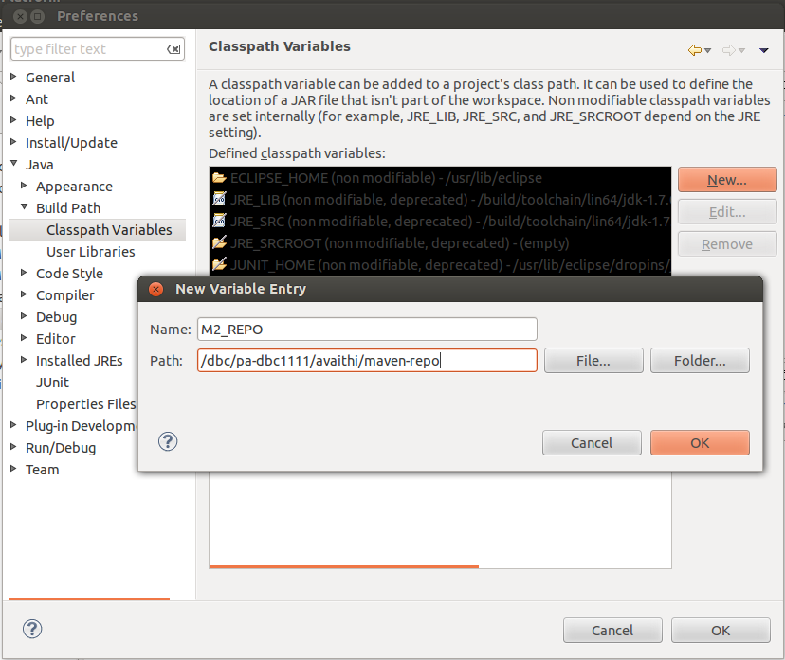
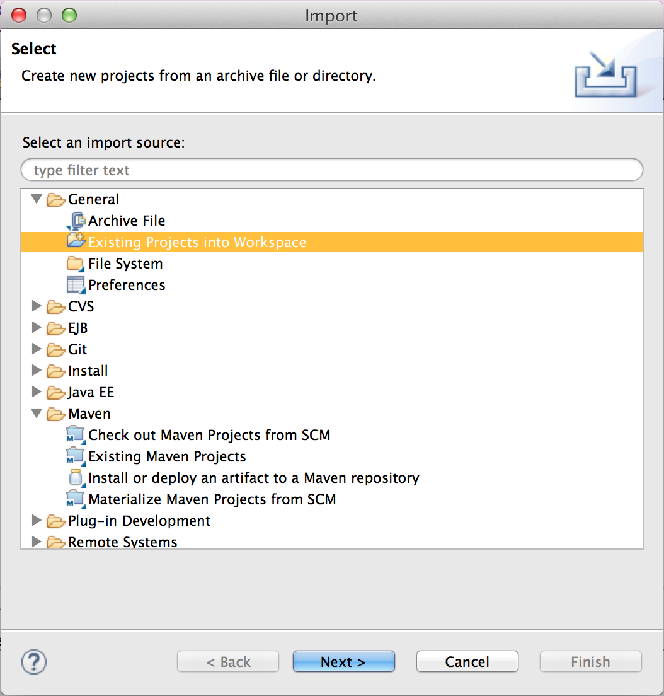
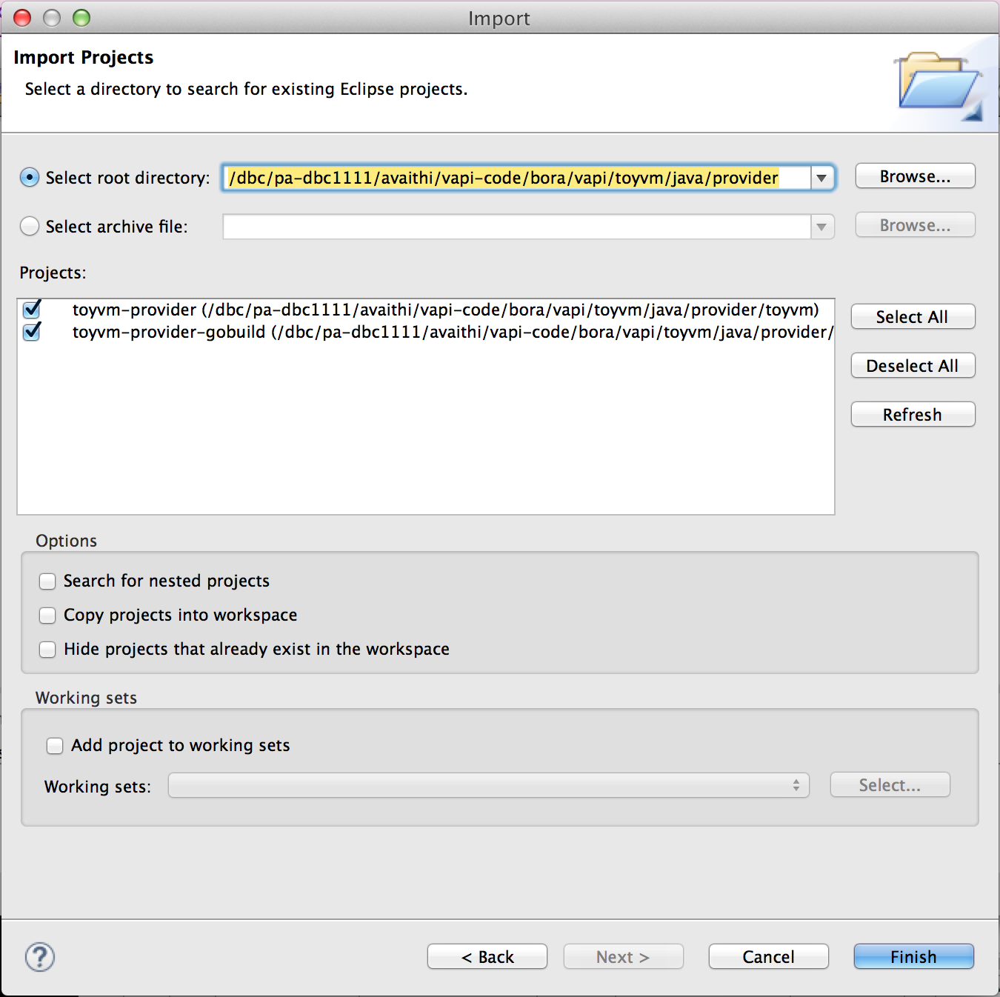
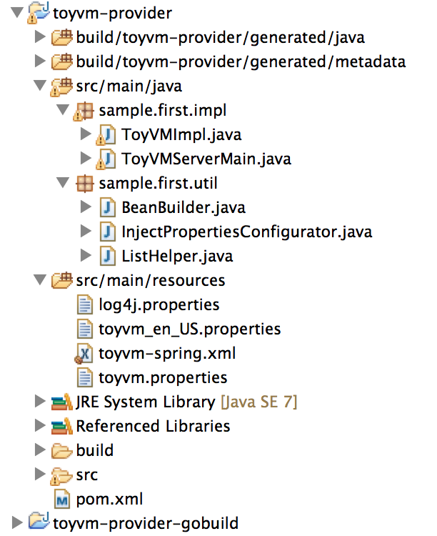

 

# Overview
After defining the service interface using VMODL2, the next step is to implement and stand up the service. The tutorial provides instructions to stand up the service either by using maven, via eclipse or by running individual commands. The underlying steps in all these methods are the same.

#Using Maven
In maven the details of each step of the process to stand up a service
is defined in the `pom.xml` files.

-   There is a parent `pom.xml` in the start of provider folder at
    `$VAPI_PDK/toyvm/java/provider` .
-   Then there is a `pom.xml` in each of the `toyvm` and `local-deps`
    sub-modules.
-   The `toyvm` module contains the source and resource files. The
    `pom.xml` in this module is responsible for generation of the
    metadata and java bindings, adding resources and other details
    needed by the maven and java compiler.
-   The `local-deps` module contains nothing but the `pom.xml` which has
    plugins to install the vAPI dependencies available in the PDK into the local maven repository.

***Note***: Before running the maven command, configure your environment using the instructions [here](../setting_up/configuring_the_environment.md#java)

The Java provider project can be built using Maven:
<div>
    <!-- Nav tabs -->
    <ul class="nav nav-tabs">
        <li class="active">
            <a id="linExecMvnTab" href="#linExecMvn" data-toggle="tab">Linux</a>
        </li>
        <li>
            <a id="winExecMvnTab" href="#winExecMvn" data-toggle="tab">Windows</a>
        </li>
    </ul>
    <div class="codePart">
        <!-- Tab panes -->
        <div class="tab-content">
            <div class="tab-pane active" id="linExecMvn">
                vapi-pdk$ cd toyvm/java/provider<br>
                provider$ mvn clean install
                <span class="collapseTitle collapsed" data-toggle="collapse" data-target="#mvnCleanInstall">&nbsp;</span>
            </div>
            <div class="tab-pane" id="winExecMvn">
                vapi-pdk> cd toyvm\java\provider<br>
                provider> mvn clean install
                <span class="collapseTitle collapsed" data-toggle="collapse" data-target="#mvnCleanInstall">&nbsp;</span>
            </div>
        </div>
        <div id="mvnCleanInstall" class="collapseContent collapse">
[INFO] ------------------------------------------------------------------------  
[INFO] Reactor Summary:  
[INFO]  
[INFO] toyvm-provider-parent .............................. SUCCESS [  0.492 s]  
[INFO] toyvm-provider-local ............................... SUCCESS [  2.988 s]  
[INFO] toyvm-provider ..................................... SUCCESS [ 40.451 s]  
[INFO] ------------------------------------------------------------------------  
[INFO] BUILD SUCCESS  
[INFO] ------------------------------------------------------------------------  
[INFO] Total time: 44.128 s  
[INFO] Finished at: 2015-03-27T11:57:08-07:00  
[INFO] Final Memory: 26M/285M  
[INFO] ------------------------------------------------------------------------  
        </div>
    </div>
</div>
&nbsp;
<div class="successPart">
**Success!** You have built the required binaries to run the java server.
</div>

To start the server, run the following command:

<div>
    <!-- Nav tabs -->
    <ul class="nav nav-tabs">
        <li class="active">
            <a id="linAppRunTab" href="#linAppRun" data-toggle="tab">Linux</a>
        </li>
        <li>
            <a id="winAppRunTab" href="#winAppRun" data-toggle="tab">Windows</a>
        </li>
    </ul>
    <div class="codePart">
        <!-- Tab panes -->
        <div class="tab-content">
            <div class="tab-pane active" id="linAppRun">
                vapi-pdk$ build/maven/toyvm/toyvm-provider/appassembler/bin/toyvm-provider
            </div>
            <div class="tab-pane" id="winAppRun">
                vapi-pdk> build\maven\toyvm\toyvm-provider\appassembler\bin\toyvm-provider.bat
            </div>
        </div>
    </div>
</div>

To test that the server is actually running open `http://localhost:8088/rest` in a browser. It should show a json containing rest metadata.

<div class="successPart">
**Success!** You have the Java server running now.
</div>

The remainder of this page describes how to achieve the same thing through Eclipse or through simple commands on the command line.

<br>
#####Using gobuild
The maven project uses the vAPI java runtime jars from the downloaded PDK directory and installs them into the local maven repository. If you want to see an example of how to get the jars from `vapi-core` gobuild component and install them into the local maven repository, use the following steps:
-   Update the specs file for gobuild target 'toyvm' to pick up the right build of `vapi-core`
    -   The file is located at `$VAPI_PDK/support/gobuild/specs/toyvm.py`
    -   Assign the variable `VAPI_CORE_CLN = <CHANGELIST_NUMBER>` with the *Perforce Change Number* provided in the [overview page of this book](../README.md).
-   Use `pom_gobuild.xml` to build the project.
    -   The `pom_gobuild.xml` file uses `gobuild/pom.xml` instead of `local-deps/pom.xml` to fetch and install vAPI jars from vapi-core build using gobuild.

<div>
    <!-- Nav tabs -->
    <ul class="nav nav-tabs">
        <li class="active">
            <a id="linMvnGobuildTab" href="#linMvnGobuild" data-toggle="tab">Linux</a>
        </li>
        <li>
            <a id="winMvnGobuildTab" href="#winMvnGobuild" data-toggle="tab">Windows</a>
        </li>
    </ul>
    <div class="codePart">
        <!-- Tab panes -->
        <div class="tab-content">
            <div class="tab-pane active" id="linMvnGobuild">
                vapi-pdk$ cd toyvm/java/provider<br>
                provider$ mvn --file pom_gobuild.xml clean install
            </div>
            <div class="tab-pane" id="winMvnGobuild">
                vapi-pdk> cd toyvm\java\provider<br>
                provider> mvn --file pom_gobuild.xml clean install
            </div>
        </div>
    </div>
</div>

# Using Eclipse
We use maven to generate Eclipse IDE files for use of an Eclipse
project. With these file, the ToyVM provider project can be imported
into eclipse.

<div>
    <!-- Nav tabs -->
    <ul class="nav nav-tabs">
        <li class="active">
            <a id="linMvnEclipseTab" href="#linMvnEclipse" data-toggle="tab">Linux</a>
        </li>
        <li>
            <a id="winMvnEclipseTab" href="#winMvnEclipse" data-toggle="tab">Windows</a>
        </li>
    </ul>
    <div class="codePart">
        <!-- Tab panes -->
        <div class="tab-content">
            <div class="tab-pane active" id="linMvnEclipse">
                vapi-pdk$ cd toyvm/java/provider  
                provider$ mvn clean install -Dbuildroot=build  
                provider$ mvn eclipse:clean eclipse:eclipse -Dbuildroot=build -DdownloadSources=true  
            </div>
            <div class="tab-pane" id="winMvnEclipse">
                vapi-pdk> cd toyvm\java\provider  
                provider> mvn clean install -Dbuildroot=build  
                provider> mvn eclipse:clean eclipse:eclipse -Dbuildroot=build -DdownloadSources=true  
            </div>
        </div>
    </div>
</div>
Follow these steps to import the project into Eclipse:

##### Set up maven for Eclipse
If your eclipse **does not have maven plugin** installed, add the a variable named M2\_REPO to classpath and point it to the directory standing for your local maven repo
-   Go to: Window \> Preferences
-   From the left panel, go to: Java \> Build Path \> Classpath Variables
-   From the panel on the right, select 'New...'
-   Enter 'M2\_REPO' for the Name and your local maven directory's in the text box for Path.
-   Select OK for both the dialogs



If your eclipse **has maven plugin** installed, update maven user settings to point to the right settings.xml
-   Go to: Window \> Preferences
-   From the left panel, go to: Maven \> User Settings
-   Click 'Browse'
-   Select the path to your local maven settings.xml
    -   It is not at the directory in the screenshot below
-   Select OK


#####Import the provider's eclipse project generated by maven
-   Go to: File \> Import
-   Expand 'General'
-   Select 'Existing Projects into Workspace'
-   Click 'Next'



-   The root directory for the ToyVM service provider's project is at
    `$VAPI-PDK/toyvm/java/provider`
    -   It is not at the directory in the screenshot below
-   Select 'Finish'


#####View project
-   After the steps are completed, look for the project in the 'Project
    Explorer' tab:



#####Running the project:
-   Build the project. Usually the option 'Build Automatically' is set. So, this step is a moot point. If it is not set,
-   In the 'Project Explorer', expand 'toyvm-provider'
-   Expand 'src/main/java'
-   Expand 'sample.first.impl'
-   Right click on 'ToyVMServerMain.java'
-   Select 'Run As' \> 'Java Application'

#Using individual commands
##Generating Skeleton
The PDK includes a code generator `java-generator` that parses the interface definition and generates skeletons.
<div>
    <!-- Nav tabs -->
    <ul class="nav nav-tabs">
        <li class="active">
            <a id="linGenSkelTab" href="#linGenSkel" data-toggle="tab">Linux</a>
        </li>
        <li>
            <a id="winGenSkelTab" href="#winGenSkel" data-toggle="tab">Windows</a>
        </li>
    </ul>
    <div class="codePart">
        <!-- Tab panes -->
        <div class="tab-content">
            <div class="tab-pane active" id="linGenSkel">
                vapi-pdk$ java-toolkit/bin/java-generator --profile provider --library idl-toolkit/vmidl/vapi_stdlib.vmidl --output build/toyvm/generated/provider toyvm/vmodl
                <span class="collapseTitle collapsed" data-toggle="collapse" data-target="#genSkelOut">&nbsp;</span>
            </div>
            <div class="tab-pane" id="winGenSkel">
                vapi-pdk> java-toolkit\bin\java-generator.bat --profile provider --library idl-toolkit/vmidl/vapi_stdlib.vmidl --output build/toyvm/generated/provider toyvm/vmodl
                <span class="collapseTitle collapsed" data-toggle="collapse" data-target="#genSkelOut">&nbsp;</span>
            </div>
        </div>
        <div id='genSkelOut' class="collapseContent collapsing">
INFO: Generating java files ...  
INFO: Processing target language: java  
INFO:  > Found 1 java language 'models' templates ...  
INFO:  > Found 2 java language 'packages' templates ...  
INFO:  > Found 8 java language 'services' templates ...  
INFO:  > Found 1 java language 'structures' templates ...  
INFO:  > Found 1 java language 'enumerations' templates ...  
INFO: Processing model scope templates ...  
INFO:  > Generating file: build/toyvm/generated/provider/java/sample/first/util/StructTypeUtil.java ...  
INFO: Processing package scope templates for 'idl.model.IdlPackage(name:sample.first)' ...  
INFO:  > Generating file: build/toyvm/generated/provider/java/sample/first/StructDefinitions.java ...  
INFO:  > Generating file: build/toyvm/generated/provider/java/sample/first/package-info.java ...  
INFO: Processing service scope templates for 'ToyVM' ...  
INFO:  > Generating file: build/toyvm/generated/provider/java/sample/first/ToyVM.java ...  
INFO:  > Generating file: build/toyvm/generated/provider/java/sample/first/ToyVMApiInterface.java ...  
INFO:  > Generating file: build/toyvm/generated/provider/java/sample/first/ToyVMDefinitions.java ...  
INFO:  > Generating file: build/toyvm/generated/provider/java/sample/first/ToyVMProvider.java ...  
INFO:  > Generating file: build/toyvm/generated/provider/java/sample/first/ToyVMSyncApiInterface.java ...  
INFO:  > Generating file: build/toyvm/generated/provider/java/sample/first/ToyVMSyncProvider.java ...  
INFO:  > Generating file: build/toyvm/generated/provider/java/sample/first/ToyVMTypes.java ...  
        </div>
    </div>
</div>
The generator creates a Java package and interface/class structure based on the services defined in the IDL. These files are put in a sub-directory named java under the provided output directory. The `ToyVMApiInterface` class is skeleton code, used to expose the `ToyVM` service through the vAPI infrastructure. The `ToyVMProvider` interface is a mapping of the service into Java for the use of the skeleton.

####Generating Metadata
The API infrastructure provides metadata services that expose the information about the API to the clients. This will enable clients to introspect and discover APIs available on a particular vAPI server. The PDK provides `metadata-generator` that generates json metadata files based on the input API definition. The metadata services expose the data present in these metadata files.
<div>
    <!-- Nav tabs -->
    <ul class="nav nav-tabs">
        <li class="active">
            <a id="linGenMetaTab" href="#linGenMeta" data-toggle="tab">Linux</a>
        </li>
        <li>
            <a id="winGenMetaTab" href="#winGenMeta" data-toggle="tab">Windows</a>
        </li>
    </ul>
    <div class="codePart">
        <!-- Tab panes -->
        <div class="tab-content">
            <div class="tab-pane active" id="linGenMeta">
                vapi-pdk$ metadata-toolkit/bin/metadata-generator --library idl-toolkit/vmidl/vapi_stdlib.vmidl --output build/toyvm toyvm/vmodl <span class="collapseTitle collapsed" data-toggle="collapse" data-target="#genMetaOut">&nbsp;</span>
                </div>
            <div class="tab-pane" id="winGenMeta">
                vapi-pdk> metadata-toolkit\bin\metadata-generator.bat --library idl-toolkit/vmidl/vapi_stdlib.vmidl --output build/toyvm toyvm/vmodl
                <span class="collapseTitle collapsed" data-toggle="collapse" data-target="#genMetaOut">&nbsp;</span>
            </div>
        </div>
        <div id='genMetaOut' class="collapseContent collapse">
INFO: Generating metadata files ...  
INFO: Processing target language: metadata  
INFO:  > Found 5 metadata language 'products' templates ...  
INFO: Processing product scope templates ...  
INFO:  > Generating file: build/toyvm/metadata/sample.first_authentication.json ...  
INFO:  > Generating file: build/toyvm/metadata/sample.first_authorization.json ...  
INFO:  > Generating file: build/toyvm/metadata/sample.first_cli.json ...  
INFO:  > Generating file: build/toyvm/metadata/sample.first_metamodel.json ...  
INFO:  > Generating file: build/toyvm/metadata/sample.first_routing.json ...  
        </div>
    </div>
</div>
The generated metadata files will be referenced in the service configuration file that contains the configuration information for ToyVM and all the metadata services.  
**Note**: We pass as argument to the `metadata-generator` , the path to the package that contains the vmodl file. The generator aggregates all the vmodl files in the package while generating the metadata files. The aggregation is based on the `package-info.java` which defines which component the files in the package and the sub-packages belong too. More information about packaging can be obtained at the [vAPI specs page](https://wiki.eng.vmware.com/VAPI/Specs/VMODL2#Packaging).   
    Library option is provided to enable inter component structure reference. The `vapi_stdlib.vmidl` file lists the elements that are defined in the `com.vmware.vapi.std` component. This is needed because, `ToyVM` service in `sample.first` component defined in `$VAPI-PDK/toyvm/vmodl` directory, is referring the `Error` structures defined in `com.vmware.vapi.std.errors` package of `com.vmware.vapi.std` component. 

-   The mapping between APIs and CLIs is governed by a JSON metadata file, `sample.first_cli.json` . This file describes the set of CLI namespaces and commands and how they map to the underlying CLIs; it also contains information about output formatting and other CLI-specific metadata. 
    -   It's possible to customize the API-to-CLI mapping to change the output formatting options, rename command-line options or add short options for convenience, etc., but such customizations are beyond the scope of this tutorial; in this example we'll go ahead and use the generated metadata file. 

-   The `sample.first_metamodel.json` file contains elements that represent all the information present in the interface definition language (IDL) specification. The main elements are component, package, service, operation, structure and enumeration.

-   Since ToyVM does not using authentication (or) vAPI authorization filter (or) vAPI routing functionality the authentication.json, authorization.json and routing.json files do not contain any useful information and will not be used anywhere. More information about these functionalities can be found here: [Authentication](https://wiki.eng.vmware.com/VAPI/Specs/Design/Authentication "VAPI/Specs/Design/Authentication"), [Authorization](https://wiki.eng.vmware.com/VAPI/Specs/Design/Authorization "VAPI/Specs/Design/Authorization") and [Routing](https://wiki.eng.vmware.com/VAPI/Specs/Router "VAPI/Specs/Router")

##Implementing the Interface
Implementation of the ToyVM service is accomplished by defining a class that implements the generated service provider (server-side, skeleton) Java interface. Each method in the interface has a special parameter of type `AsyncContext` for returning result back to the runtime. An operation invocation is considered complete only after the `setResult()` or the `setError()` method of `AsyncContext` is called.
```java
public class ToyVMImpl implements ToyVMProvider {
 {
     .
     .
     .
     public ToyVMImpl(long minCpus, long maxCpus,
                      long defaultNumCpus, long defaultMemSize){
         this.minCpus = minCpus;
         this.maxCpus = maxCpus;
         this.defaultNumCpus = defaultNumCpus;
         this.defaultMemSize = defaultMemSize;
         vmMap = new ConcurrentHashMap<String, ToyVMTypes.Info>();
         idCounter = 0;
     }
     .
     .
     .
     @Override
     public void delete(String vmId, AsyncContext<Void> asyncContext) {
         ToyVMTypes.Info info = vmMap.remove(vmId);
         if (info == null) {
             Error err = new NotFound(
                             Arrays.asList(
                                 msgFactory.getLocalizableMessage(
                                 "sample.first.toyvm.notfound", vmId)));
             logger.error(err.toString());
             asyncContext.setError(err);
         } else {
             asyncContext.setResult(null);
         }
     }

     @Override
     public void list(AsyncContext<java.util.Set<String>> asyncContext) {
         asyncContext.setResult(vmMap.keySet());
     }
     .
     .
     .
 }
```
**Note**: The implementation package and class names are currently derived from the generated package and interface names using the mappings (`<package>` to `<package>.impl`) and (`<service-name>Provider` to `<service-name>Impl`). This is the convention followed to make it easy to find code. A Spring XML file is used to specify configuration.

##Configuring the Service
To stand up a vAPI-Java server for the ToyVM service, we need to create a spring XML file that contains information about which services to load, which wire protocols to use and configuration details for them. 
<div class="codePart">
    vapi-pdk$ cat toyvm/java/provider/toyvm/src/main/resources/toyvm-spring.xml
    <span class="collapseTitle collapsed" data-toggle="collapse" data-target="#springFile">&nbsp;</span>
    <span id="springFile" class="collapseContent collapse">
```xml
<?xml version="1.0" encoding="UTF-8"?>
 
<beans xmlns="http://www.springframework.org/schema/beans"
...>
 
 <context:property-placeholder location="classpath:toyvm.properties"
     ignore-unresolvable="false" ignore-resource-not-found="false" />
.
.
.
 <!--
  "apiProvider" is a magic/expected spring bean ID that will be used
  by SpringConfigurator to get the ApiProvider to be used.
 -->
 <bean id="apiProvider"
       class="com.vmware.vapi.provider.local.LocalProvider">
    <constructor-arg value="toyvm" />
    <constructor-arg ref="apiInterfaces">
    </constructor-arg>
 </bean>
 
 <!--
  List of interfaces corresponding to the services that need to be started at
  this endpoint.
 -->
 <bean id="apiInterfaces" class="sample.first.util.ListHelper"
       factory-method="join">
     <constructor-arg>
         <list>
             <!--
                  Each of the following items is a list. The "apiInterfaces"
                  ListHelper bean is used to concatenate these lists into a
                  single list.
             -->
             <list>
                 <ref bean="toyvmService" />
             </list>
             <ref bean="metamodelServiceInterfaces" />
             <ref bean="cliServiceInterfaces" />
         </list>
     </constructor-arg>
 </bean>
 
 <!-- ToyVM service implementation specification -->
 <bean id="toyvmService"
       class="sample.first.ToyVMApiInterface">
     <constructor-arg ref="toyvmImpl" />
 </bean>
 
 <!-- ToyVM service configuration -->
 <bean id="toyvmImpl"
       class="sample.first.impl.ToyVMImpl" >
     <constructor-arg value="${toyvm.minCpus}" type="long"/>
     <constructor-arg value="${toyvm.maxCpus}" type="long"/>
     <constructor-arg value="${toyvm.defaultNumCpus}" type="long"/>
     <constructor-arg value="${toyvm.defaultMemSize}" type="long"/>
 </bean>
 
 <!-- API interfaces for the metadata services -->
 <bean id="metamodelServiceInterfaces"
       factory-bean="metadataServiceBuilder"
       factory-method="createMetamodelServices"/>
 <bean id="cliServiceInterfaces"
       factory-bean="metadataServiceBuilder"
       factory-method="createCliServices" />
 
 <!--
  Bean used to create a MetadataServiceBuilder object which builds an
  aggregation all the metadata sources defined by the "sources" bean.
 -->
 <bean id="metadataServiceBuilder" class="sample.first.util.BeanBuilder"
     factory-method="createBuilder">
     <constructor-arg ref="messageFactory" />
     <constructor-arg ref="sources" />
 </bean>
 
 <bean class="com.vmware.vapi.MessageFactory" id="messageFactory">
     <constructor-arg>
         <bean class="java.util.ResourceBundle" factory-method="getBundle">
             <constructor-arg value="metadataservice" />
         </bean>
     </constructor-arg>
 </bean>
 
 <!--
  Each of the following beans will be a metadata service at the endpoint.
  The argument value "true" provided to the DataSourceSpec spec means
  that the specified data source (file-name) needs to be in the classpath.
 -->
 <util:list id="sources">
     <bean
         class="com.vmware.vapi.metadata.service.MetadataServiceBuilder.MetadataSource">
         <constructor-arg value="METAMODEL" />
         <constructor-arg value="toyvm-provider" />
         <constructor-arg>
             <bean
                 class="com.vmware.vapi.metadata.service.DataSourceManager.DataSourceSpec">
                 <constructor-arg
                     value="sample.first_metamodel.json" />
                 <constructor-arg value="Metadata for ToyVM metamodel service" />
                 <constructor-arg value="true" />
             </bean>
         </constructor-arg>
     </bean>
     <bean
         class="com.vmware.vapi.metadata.service.MetadataServiceBuilder.MetadataSource">
         <constructor-arg value="CLI" />
         <constructor-arg value="toyvm-provider" />
         <constructor-arg>
             <bean
                 class="com.vmware.vapi.metadata.service.DataSourceManager.DataSourceSpec">
                 <constructor-arg
                     value="sample.first_cli.json" />
                 <constructor-arg value="Metadata for ToyVM CLI service" />
                 <constructor-arg value="true" />
             </bean>
         </constructor-arg>
     </bean>
     <bean
         class="com.vmware.vapi.metadata.service.MetadataServiceBuilder.MetadataSource">
         <constructor-arg value="METAMODEL" />
         <constructor-arg value="common" />
         <constructor-arg>
             <bean
                 class="com.vmware.vapi.metadata.service.DataSourceManager.DataSourceSpec">
                 <constructor-arg
                     value="vapi_common_metamodel.json" />
                 <constructor-arg value="Metadata for vAPI common metamodel service" />
                 <constructor-arg value="true" />
             </bean>
         </constructor-arg>
     </bean>
     <bean
         class="com.vmware.vapi.metadata.service.MetadataServiceBuilder.MetadataSource">
         <constructor-arg value="CLI" />
         <constructor-arg value="common" />
         <constructor-arg>
             <bean
                 class="com.vmware.vapi.metadata.service.DataSourceManager.DataSourceSpec">
                 <constructor-arg
                     value="vapi_common_cli.json" />
                 <constructor-arg value="Metadata for vApi common CLI service" />
                 <constructor-arg value="true" />
             </bean>
         </constructor-arg>
     </bean>
 </util:list>
</beans>
```
</span>
</div>
The `${abc.lmn.xyz}` properties referenced in this Spring Bean Configuration file are defined in a properties file present in the resources folder. The `context:property-placeholder` tag at the top specifies where those properties are defined. Spring injects properties from that file into corresponding placeholders in `toyvm-spring.xml`.  
The metadata files specified in the DataSourceSpec bean, the property file and the spring file all need to be in the classpath when trying to start the service.  
Properties file used in the spring configuration:

<div class="codePart">
    vapi-pdk$ cat toyvm/java/provider/toyvm/src/main/resources/toyvm.properties
    <span class="collapseTitle collapsed" data-toggle="collapse" data-target="#propertiesFile">&nbsp;</span>
    <div id="propertiesFile" class="collapseContent collapse">
http.threadPool.minSpareThreads=1  
  
http.threadPool.maxThreads=3  
http.threadPool.maxIdleTime=2000  
http.threadPool.maxQueueSize=50  
  
http.endpoint.port=8088  
http.endpoint.maxIdleTime=360000  
  
http.service.path=/api  
  
toyvm.minCpus = 1  
toyvm.maxCpus = 128  
toyvm.defaultNumCpus = 4  
toyvm.defaultMemSize = 250  
    </div>
</div>
##Compiling the Service
Compile the generated skeleton and interface code and the hand-written implementation code using your favorite build tools. Or just use javac directly:
<div>
    <!-- Nav tabs -->
    <ul class="nav nav-tabs">
        <li class="active">
            <a id="linuxTab" href="#linuxCompile" data-toggle="tab">Linux</a>
        </li>
        <li>
            <a id="windowsTab" href="#windowsCompile" data-toggle="tab">Windows</a>
        </li>
    </ul>
    <div class="codePart">
        <!-- Tab panes -->
        <div class="tab-content">
            <div class="tab-pane active" id="linuxCompile">
            vapi-pdk$ mkdir -p build/toyvm/classes  
            vapi-pdk$ javac -g -d build/toyvm/classes -cp toyvm/java/deps/\\\* build/toyvm/generated/provider/java/sample/first/ToyVM\*.java  
            vapi-pdk$ ls build/toyvm/classes/sample/first
            <span id="linFirstDirLs" class="collapseTitle collapsed" data-toggle="collapse" data-target="#linFirstDir">&nbsp;</span>
            <br/>
            <div id='linFirstDir' class="collapseContent collapse">
ToyVM.class ToyVMSyncProvider.class  
.  
.  
.  
ToyVMApiInterface.class ToyVMTypes$CreateSpec.class  
ToyVMDefinitions$1.class ToyVMTypes$DiskBacking$Type$Values.class  
ToyVMDefinitions$2.class ToyVMTypes$DiskBacking$Type.class  
ToyVMDefinitions$3.class ToyVMTypes$DiskBacking.class  
ToyVMDefinitions$4.class ToyVMTypes$Info.class  
ToyVMDefinitions$5.class ToyVMTypes$PowerState$Values.class  
ToyVMDefinitions$6.class ToyVMTypes$PowerState.class  
ToyVMDefinitions.class ToyVMTypes$UpdateSpec.class  
ToyVMProvider.class  ToyVMTypes.class  
.  
.  
.  
                </div>
                <br/>
                vapi-pdk$ javac -g -d build/toyvm/classes -cp build/toyvm/classes:toyvm/java/deps/\\\* toyvm/java/provider/toyvm/src/main/java/sample/first/impl/ToyVM\*.java toyvm/java/provider/toyvm/src/main/java/sample/first/util/\*.java  
                vapi-pdk$ ls build/toyvm/classes/sample/first/impl
                <span id="linImplDirLs" class="collapseTitle collapsed" data-toggle="collapse" data-target="#linImplDir">&nbsp;</span>
                <br/>
                <div id='linImplDir' class="collapseContent collapse">
                    ToyVMImpl$1.class ToyVMImpl.class ToyVMServerMain.class
                </div>
            </div>
            <div class="tab-pane" id="windowsCompile">
                vapi-pdk> mkdir build\toyvm\classes  
                vapi-pdk> javac -g -d build\toyvm\classes -cp toyvm\java\deps\\\* build\toyvm\generated\provider\java\sample\first\ToyVM\*.java  
                vapi-pdk> dir build\toyvm\classes\sample\first
                <span id="winFirstDirLs" class="collapseTitle collapsed" data-toggle="collapse" data-target="#winFirstDir">&nbsp;</span>
                <br/><br/>
                vapi-pdk> javac -g -d build\toyvm\classes -cp build\toyvm\classes;toyvm\java\deps\\\* toyvm\java\provider\toyvm\src\main\java\sample\first\impl\ToyVM\*.java toyvm\java\provider\toyvm\src\main\java\sample\first\util\\*.java  
                vapi-pdk> dir build\toyvm\classes\sample\first\impl
                <span id="winImplDirLs" class="collapseTitle collapsed" data-toggle="collapse" data-target="#winImplDir">&nbsp;</span>
                <br/>
            </div>
        </div>
    </div>
</div>
   The `<classname>$<num>.class` are all anonymous inner classes defined in `<classname>.java`. Every inner class, named or not, gets its own class file. Anonymous ones are numbered in the order in which they are defined in the file, top to bottom.

##Running the Service
Since the spring configuration file requires that the files pointed by
it be present in the classpath, we add the resources and metadata
folders to the classpath. `toyvm/java/provider/toyvm/src/main/resources`
has the ToyVM specific properties and configuration files,
`build/toyvm/metadata` has ToyVM's generated metadata json files.
The metadata directory is added to the classpath because metamodel and cli metadata files for
com.vmware.vapi component are available in that directory.
We need a bootstrap main method defined in
`sample.first.impl.ToyVMServerMain` to put all the configuration
together and start the server. With the compiled main server class, we
can start up the service:
<div>
    <!-- Nav tabs -->
    <ul class="nav nav-tabs">
        <li class="active">
            <a id="linGenSkelTab" href="#linRunServer" data-toggle="tab">Linux</a>
        </li>
        <li>
            <a id="winGenSkelTab" href="#winRunServer" data-toggle="tab">Windows</a>
        </li>
    </ul>
    <div class="codePart">
        <!-- Tab panes -->
        <div class="tab-content">
            <div class="tab-pane active" id="linRunServer">
                vapi-pdk$ java -cp build/toyvm/classes:build/toyvm/metadata:toyvm/java/provider/toyvm/src/main/resources:metadata:toyvm/java/deps/\\\* sample.first.impl.ToyVMServerMain
                <span class="collapseTitle collapsed" data-toggle="collapse" data-target="#runServerOut">&nbsp;</span>
            </div>
            <div class="tab-pane" id="winRunServer">
                vapi-pdk> java -cp build\toyvm\classes;build\toyvm\metadata;toyvm\java\provider\toyvm\src\main\resources;metadata;toyvm\java\deps\\\* sample.first.impl.ToyVMServerMain
                <span class="collapseTitle collapsed" data-toggle="collapse" data-target="#runServerOut">&nbsp;</span>
            </div>
        </div>
        <div id='runServerOut' class="collapseContent collapse">
INFO [main] (XmlBeanDefinitionReader.java:315) - Loading XML bean definitions from class path resource [toyvm-spring.xml]  
INFO [main] (PropertiesLoaderSupport.java:177) - Loading properties file from class path resource [toyvm.properties]  
INFO [main] (DefaultListableBeanFactory.java:557) - Pre-instantiating singletons in org.springframework.beans.factory.support.DefaultListableBeanFactory@198b8b57: defining beans [protocolHandler, httpOnlyServer, httpThreadPool, httpServerEndpoint, httpVapiService, vApiServlet, mediaTypeResolver, jsonProtocol, apiProvider, apiInterfaces, toyvmService, toyvmImpl, metamodelServiceInterfaces, cliServiceInterfaces, metadataServiceBuilder, messageFactory, sources]; root of factory hierarchy  
INFO [main] (LocalProvider.java:178) - Registered the interface identifier com.vmware.vapi.std.introspection.provider  
INFO [main] (LocalProvider.java:178) - Registered the interface identifier com.vmware.vapi.std.introspection.service  
INFO [main] (LocalProvider.java:178) - Registered the interface identifier com.vmware.vapi.std.introspection.operation  
INFO [main] (LocalProvider.java:178) - Registered the interface identifier sample.first.toy_VM  
INFO [main] (LocalProvider.java:178) - Registered the interface identifier com.vmware.vapi.metadata.metamodel.component  
INFO [main] (LocalProvider.java:178) - Registered the interface identifier com.vmware.vapi.metadata.metamodel.enumeration  
INFO [main] (LocalProvider.java:178) - Registered the interface identifier com.vmware.vapi.metadata.metamodel.resource.model  
INFO [main] (LocalProvider.java:178) - Registered the interface identifier com.vmware.vapi.metadata.metamodel.service.operation  
INFO [main] (LocalProvider.java:178) - Registered the interface identifier com.vmware.vapi.metadata.metamodel.package  
INFO [main] (LocalProvider.java:178) - Registered the interface identifier com.vmware.vapi.metadata.metamodel.resource  
INFO [main] (LocalProvider.java:178) - Registered the interface identifier com.vmware.vapi.metadata.metamodel.service  
INFO [main] (LocalProvider.java:178) - Registered the interface identifier com.vmware.vapi.metadata.metamodel.structure  
INFO [main] (LocalProvider.java:178) - Registered the interface identifier com.vmware.vapi.metadata.metamodel.source  
INFO [main] (LocalProvider.java:178) - Registered the interface identifier com.vmware.vapi.metadata.cli.command  
INFO [main] (LocalProvider.java:178) - Registered the interface identifier com.vmware.vapi.metadata.cli.namespace  
INFO [main] (LocalProvider.java:178) - Registered the interface identifier com.vmware.vapi.metadata.cli.source  
INFO [main] (TcServer.java:138) - Starting server on [HTTP:0.0.0.0:8088]  
Oct 16, 2014 9:44:35 AM org.apache.catalina.core.AprLifecycleListener init  
INFO: The APR based Apache Tomcat Native library which allows optimal performance in production environments was not found on the java.library.path: /Users/avaithi/Library/Java/Extensions:/Library/Java/Extensions:/Network/Library/Java/Extensions:/System/Library/Java/Extensions:/usr/lib/java:.  
Oct 16, 2014 9:44:35 AM org.apache.coyote.AbstractProtocol init  
INFO: Initializing ProtocolHandler ["http-bio-0.0.0.0-8088"]  
Oct 16, 2014 9:44:35 AM org.apache.catalina.core.StandardService startInternal  
INFO: Starting service Tomcat  
Oct 16, 2014 9:44:35 AM org.apache.catalina.core.StandardEngine startInternal  
INFO: Starting Servlet Engine: VMware vFabric tc Runtime 2.6.4.RELEASE/7.0.25.B.RELEASE  
Oct 16, 2014 9:44:36 AM org.apache.coyote.AbstractProtocol start  
INFO: Starting ProtocolHandler ["http-bio-0.0.0.0-8088"]  
        </div>
    </div>
</div>
The log shows the service listening on port 8088.  
# Next Steps
- To learn more details about Java runtime, see the [runtime guide](https://wiki.eng.vmware.com/VAPI/Guide/Runtime/Java).
- To learn how to add authentication to a java server, see the [authentication guide](https://wiki.eng.vmware.com/VAPI/Guide/QuickTutorial/Authentication).

